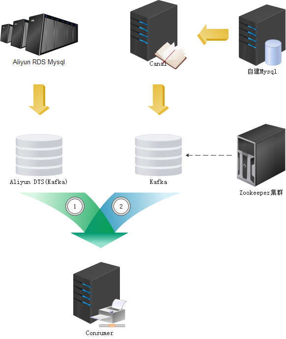

# 如果需要更新`dtsavro`目录，方式如下:

- 1. 安装解析工具
`go install github.com/actgardner/gogen-avro/v7/cmd/...`

到下载目录`$GOPATH/bin/gogen-avro`可以看到安装结果

- 2. 运行下面命令生成`avro`序列化/反序列化代码:
`./gogen-avro  --package=dtsavro ./dtsavro ../avro/Record.avsc`

这个命令意思是我们使用`Record.asvc`文件，生成`package` 为 `dtsavro` 的文件，生成到`./dtsavro`目录下

# `kfkdts`包

`kfkdts`包目前只实现1与2流程解析
